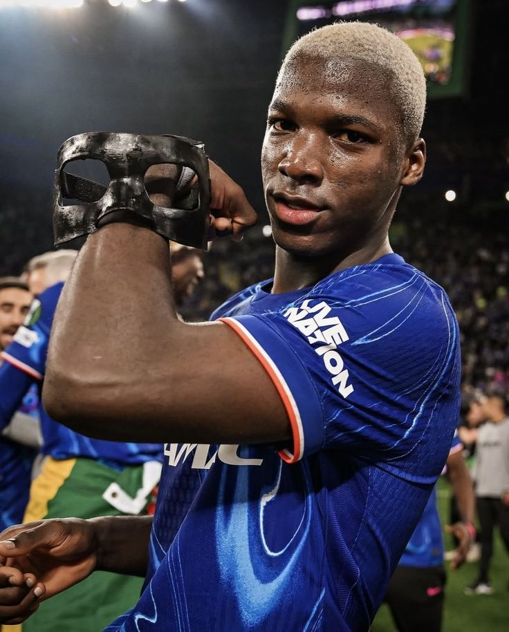
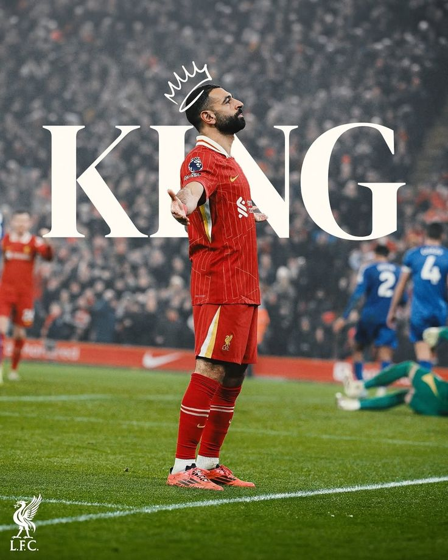
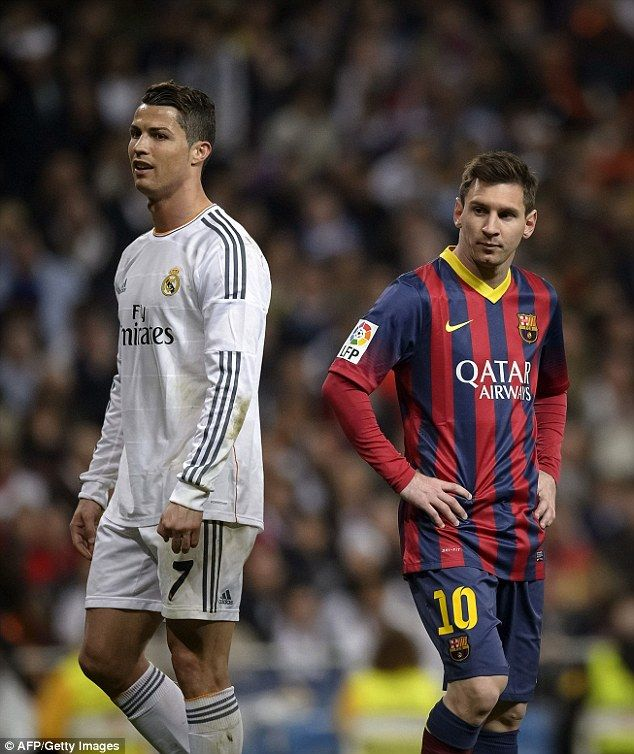
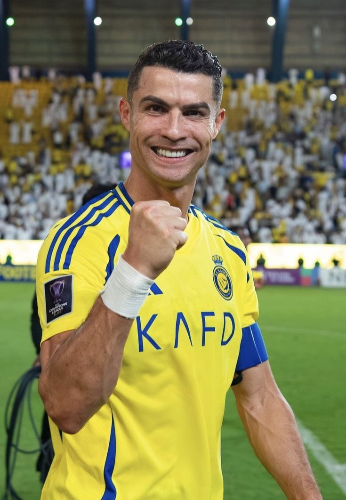

<!DOCTYPE html>
<html lang="en">
<head>
    <meta charset="UTF-8">
    <meta name="viewport" content="width=device-width, initial-scale=1.0">

    <title>Alex Gichohi News | Football Updates</title>
    <meta name="description"
        content="Alex Gichohi News delivers fast, accurate football news, transfers, match reports, and player features.">

    
</head>

<body>

    <!-- Welcome Popup -->
    

        <h3>Welcome to Alex Gichohi News ⚽</h3>
        
Your trusted source for football news, transfers, and match reports.

        
Site Ref: J26-8676-2024

        <button onclick="closePopup()">Enter Site</button>
    

    <!-- Header -->
    <header>
        <h1>Alex Gichohi News</h1>
        
Fast • Accurate • Exciting Football News

    </header>

    <!-- Navigation -->
    <nav>
        <a href="#matches">Matches</a>
        <a href="#transfers">Transfers</a>
        <a href="#opinions">Opinions</a>
    </nav>

    <!-- Main Content -->
    

        <!-- MATCH REPORT -->
        <section id="matches">
            <h2>Match Report</h2>

            

                <h3>Scott McTominay Strikes TWICE! 👊 | Man Utd 2-1 Chelsea</h3>
                
                

                    Scott McTominay delivered a stunning performance, scoring twice as Manchester United defeated
                    Chelsea 2-1 in a thrilling Premier League clash.
                

                

                    <a href="#">Facebook</a> | <a href="#">Twitter</a> | <a href="#">WhatsApp</a>
                

            

        </section>

        <!-- TRANSFER NEWS -->
        <section id="transfers">
            <h2>Transfer News</h2>

            

                <h3>Mbappé – Real Madrid: Transfer Almost Complete</h3>
                
                

                    Kylian Mbappé is reportedly closing in on a long-awaited move to Real Madrid in one of football’s
                    biggest transfers.
                

                

                    <a href="#">Facebook</a> | <a href="#">Twitter</a> | <a href="#">WhatsApp</a>
                

            

            

                <h3>Moisés Caicedo 💙: Chelsea’s Midfield Powerhouse</h3>
                
                

                    Moisés Caicedo continues to impress at Chelsea, providing strength, control, and discipline in
                    midfield.
                

                

                    <a href="#">Facebook</a> | <a href="#">Twitter</a> | <a href="#">WhatsApp</a>
                

            

        </section>

        <!-- OPINIONS & FEATURES -->
        <section id="opinions">
            <h2>Opinions & Features</h2>

            

                <h3>Mo Salah 👑: A Ballon d’Or Worthy King</h3>
                
                

                    Mohamed Salah’s consistency, leadership, and goals continue to place him among football’s elite.
                

            

            

                <h3>Messi and Ronaldo Could Line Up Together in UEFA All-Star Match</h3>
                
                

                    Football fans worldwide could witness history as Lionel Messi and Cristiano Ronaldo play together.
                

            

            

                <h3>Cristiano Ronaldo: The Legend Still Writing History</h3>
                
                

                    Cristiano Ronaldo continues to break records and inspire millions across the globe.
                

            

        </section>

    

    <!-- Footer -->
    <footer>
        
© 2026 Alex Gichohi News

        
Reference ID: J26-8676-2024

    </footer>

    <!-- Script -->
    

</body>
</html>
